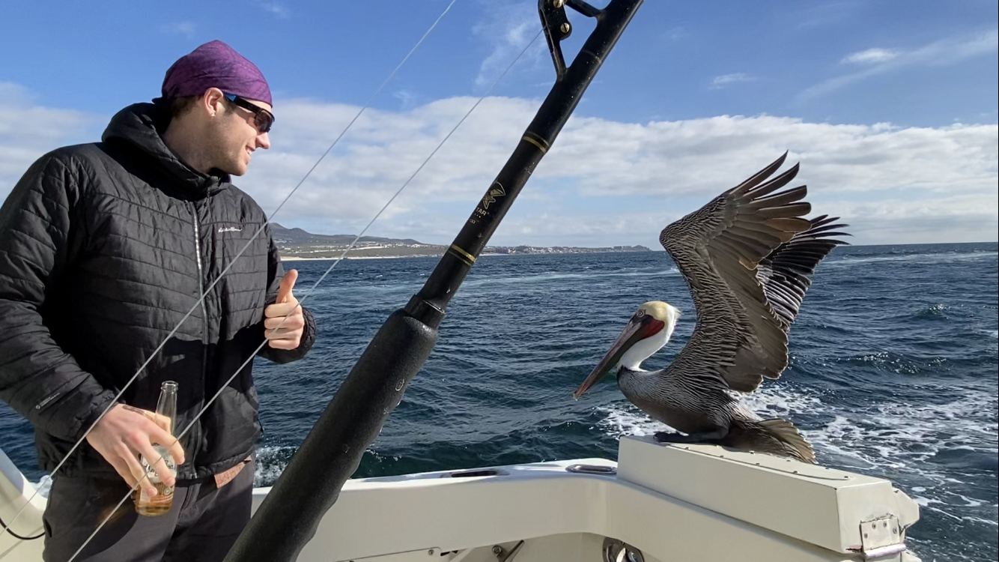

I am an ecologist with particular interests in wildlife and biogeochemistry. Most of my research examines wildlife responses to human activities and its broader consequences for ecosystems - bridging gaps between animal science (ecology, nutrition, physiology, movement, and behavior) and ecosystem functioning. I am largely motivated by issues of conservation and sustainability and strive to conduct research that improves the way we understand and protect biodiversity.

I am currently a PhD candidate in the Ecology and Evolutionary Biology Department at Cornell University advised by [Dr. Alex Flecker](https://fleckerlab.weebly.com/){target="_blank"}. I am also the President of the [Amazon Research & Conservation Collaborative (ARCC)](https://www.rainforest-arcc.org/){target="_blank"}, a 501(c)(3) nonprofit focused on conserving the Ecuadorian Amazon. I received my BS in Environmental Science with an emphasis in Terrestrial Ecology from Western Washington University, advised by [Dr. John McLaughlin](https://faculty.jmcl.wwu.edu/). Prior to my PhD, I worked as a GIS Program Lead for [Cascade Water Alliance](https://cascadewater.org/), a municipal water corporation in the Puget Sound region. I have worked various outdoor jobs in the past (e.g., guide, technician), and am passionate about being in the field. I grew up in the North Cascade Mountains of Washington State and will always call the Pacific Northwest home.

```{r setup, include=FALSE}
remotes::install_github("mitchelloharawild/icons")
icons::download_fontawesome()
```

<hr />

**`r icons::fontawesome("instagram")` - Follow me on [Instagram](https://www.instagram.com/ethanduvall.ecology)**

**`r icons::fontawesome("twitter")` - Follow me on [Twitter](https://twitter.com/DuvallEcology)**

**`r icons::fontawesome("google")` - Explore my research on [Google Scholar](https://scholar.google.com/citations?user=hrYz_sIAAAAJ&hl=en)**

<hr />

**Recent blogs, comments, and media coverage**

**`r icons::fontawesome("newspaper")` - NATURE CLIMATE CHANGE: ["Resisting the carbonization of animals as climate solutions"](https://www.nature.com/articles/s41558-024-02106-y.epdf?sharing_token=HOaCEq1KMVVXYbacg5Mi1NRgN0jAjWel9jnR3ZoTv0PW8wVlnCj38vstc67HcL_Ew8eonwiGkEe1KJb5oNHaMKJukKC7Ld35y8mWLvHKKs4zcOsvNIpUTJDqIXsRojjWQYynQ2KvqnW3LY8hxyRzkGwifLMVds3DaJKoTIsZCB8%3D)**

**`r icons::fontawesome("pen")` - BLOG: ["Reflections on ecotourism and wildlife conservation in the Peruvian Amazon"](https://aceer.org/reflections-on-ecotourism-and-wildlife-conservation-in-the-peruvian-amazon/)**

**`r icons::fontawesome("newspaper")` - USA TODAY: ["Climate change washed away bald eagles' food. Now these eagles are becoming farm birds."](https://www.usatoday.com/story/news/nation/2023/03/18/bald-eagles-adapt-after-climate-change/11470297002/)**

**`r icons::fontawesome("newspaper")` - PHYS.ORG: ["How feeding birds may be polluting local environments"](https://phys.org/news/2024-08-birds-polluting-local-environments.html)**

**`r icons::fontawesome("microphone")` - CBC RADIO PODCAST: ["Eagles are eating cows instead of salmon – and farmers are happy"](https://www.cbc.ca/player/play/2188569155552)**

<hr />



